# NHSN-Covid-19-Report

--

## Introduction 
The Covid-19 pandemic really changed the way we live, regardless of what part of the world you reside, you most certainly felt or still feeling the impact of this deadly virus that ravaged human civilization as we know it, waht I aim to achieve with this project is try to understand the 'what', 'when' and 'how' of the period from 2020-2023, with focus on the effects of the Covid-19 virus on Healthcare facilities across the US. For this, I used data made available by the **National Healthcare Safety Network(NHSN) database**

Walk with me on this as I attempt to delve as deep as possible into the available data, it is worth noting that these healthcare facilities are not exclusive Covid-19 centres, what this means is that they also cater for patients with all other variants of influenzas and virus infections, but for this project, I would be focusing solely on the Covid-19 related records.

## Project Goal
Perform a comprehensive analysis of the COVID-19 National Healthcare Safety Network (NHSN) data.

## Tools
- Spreadhseet
- SQL
- PowerBI for visualization

## Skills Demonstrated
SQL Manipulation techniques
- Joins
- Subqueries
- Union
- Case Statement
- Window Function
- CTE

## Cleaning and Preliminary Analysis 
Once I had the data extracted from the source, I went ahead to load it in a spreadsheet in order to get an overview of what the data is all about and determine the approach that best fits the task ahead. The dataset consists of 4 different parts, each representing one year of records.
- Firstly I removed coulmns that were irrelevant to the scope of this analysis, this practice enables me focus on the data that really matters.
- Next, i removed blank rows , this is important because, leaving blank rows in a dataset can greatly skew the results of the whole analysis, thereby rendering my work totally useless
- I replaced Null values in numric colums with zero (0) 
- Lastly, changed data types were neessary 
When I was done with all this, I took another look at the data, to ensure that all changes made have been implemented and the data is validated and resdy to be analyzed.

## Comprehensive Analysis 

_**WHICH HEALTHCARE FACILITIES HAD THE HIGHEST AVERAGE NUMBER OF DAILY COVID-19 CASES IN 2021? DISPLAY THE TOP 10 FACILITIES**_

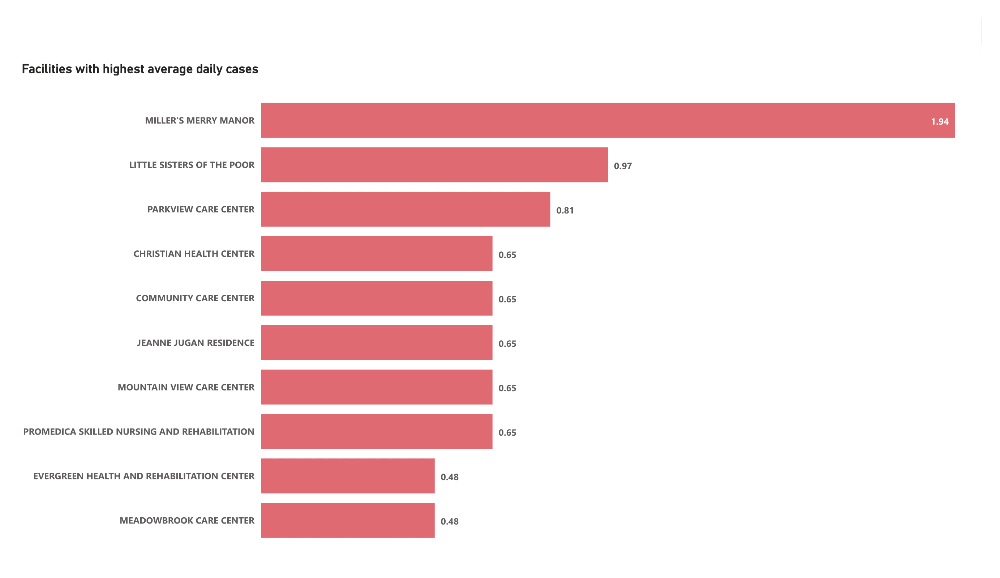

- Miller's Merry Manor comes in first with 1.94 average daily cases
- Little Sisters of the Poor had the second highest with 0.97 average daily cases
- Parkview Care Centre, Christian Health Centre and Community Care Centre make up the Top 5 with 0.81, 0.65 and 0.65 respectively.

_**CALCULATE THE 7DAY MOVING AVERAGE OF NEW COVID-19 CASES FOR EACH HEALTHCARE FACILITY. WHICH FACILITY HAD THE HIGHEST PEAK IN THE MOVING AVERAGE**_

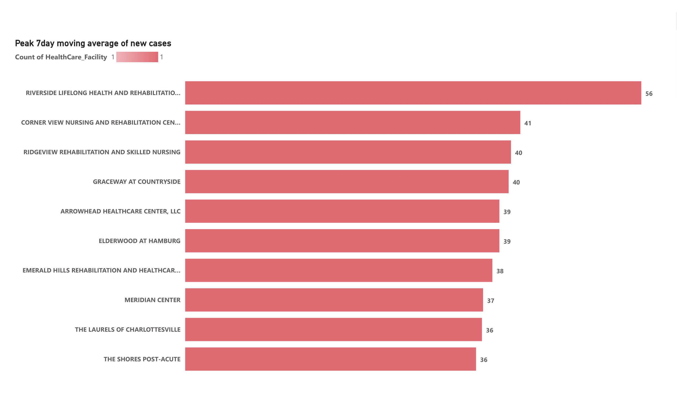

- Riverside Lifelong Health and Rehabilitation Centre had the hihest moving average with 56
- Cornerview Nursing and Rehabilitation Centre had the second highest 7day average of new cases with 41
- Ridgeview Rehabilitation and Skilled Nursing makes up the top 3 with 40 new cases in a 7day moving avegare window 

_**DETERMINE THE TOTAL NUMBER OF COVID-19 CASES, DEATHS AND RECOVERIES FOR EACH STATE, INCLUDE THE STATE'S NAME AND THE CORRESPONDING COUNT IN THE RESULTS**_

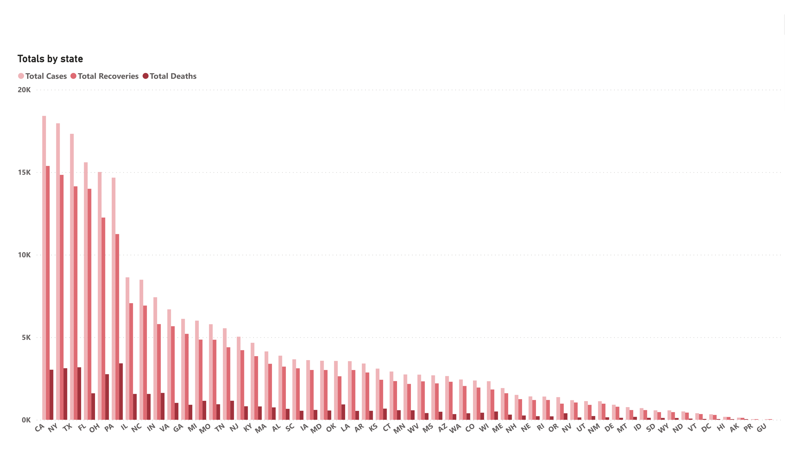

- California had 58,224
- New York and Texas makes up the Top 3 states with the highest cases of comfirmed cases

_**FIND THE TOP 5 STATES WITH THE HIGHEST MORTALITY RATE(DEATHS PER COVID-19 CASE) IN 2022**_

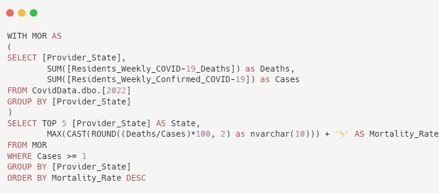
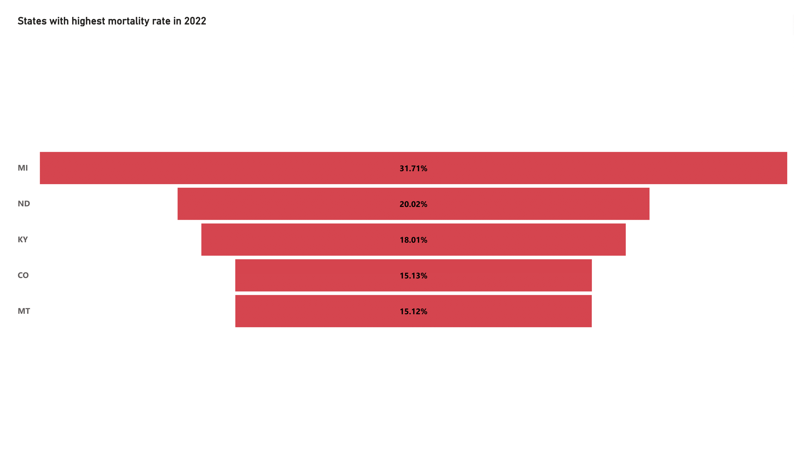

- Michicag state 31.7% was the state with the highest mortality rate in 2022
- North Dakota comes in second place with 20%
- Kentucky 18%
- Colorado 15%
- Montana 15%
While these states didn't necessarily have the highest number of cases, they had quite a number of deaths per cases, hence the high mortality rates

_**IDENTIFY THE HEALTHCARE FACILITIES THAT EXPERIENCED A SIGNIFICANT INCREASE IN COVID-19 CASES FROM 2020 TO 2021( MORE THAN 50%) INCREASE**_

_**WHAT IS THE TOTAL NUMBER OF COVID-19 CASES, DEATHS AND RECOVERIES RECORDED IN THE DATASET**_

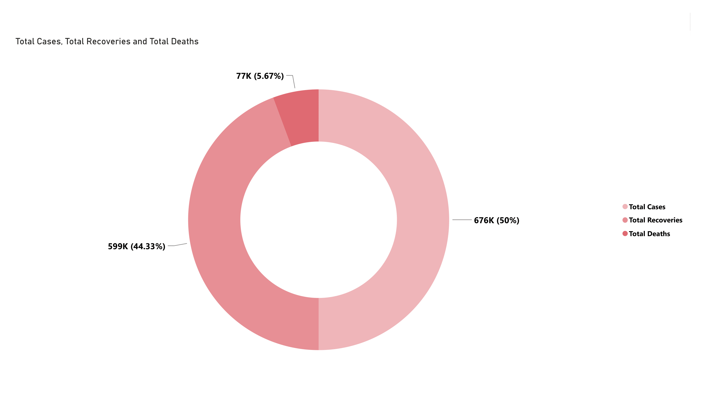

For context, 
- Total number of covid-19 cases refer to the number of comfirmed Laboratory positive test between 2020 and 2023, figures here reach over 600 thousand (676,000) 
- Total number of recoveries refer to the number of recoveries after originally been comfirmrd positive, figures reach approximately (599,000)
- Total Deaths refer to comfirmed covid-19 related deaths between 2020-2023, with figures reaching about (77,000)

_**CALCULATE THE MORTALITY RATE (DEATH PER COVID CASE) FRO EACH HEALTHCARE FACILITY**_

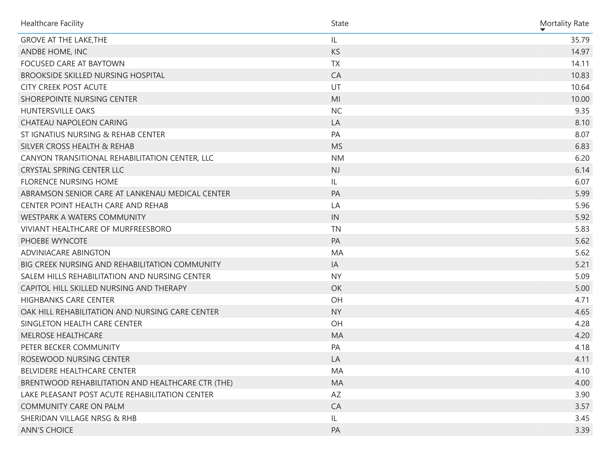

- Grove at the Lake in Ilinois tops the list of mortality rate betweeen 2020 and 2023 with figures of as high as 35.78%
- Following up is Andbe Home Inc in the state of Kansas with a mortality rate of 14.97%
- Completing the top 3 is Focused Care at Baytown in Texas with a mortality rate of 14.11%

_**ARE THERE ANY SIGNIFICANT DIFFERENCES IN COVID-19 OUTCOMES BASED ON THE TYPE OF HEALTHCARE FACILITIES (E.G, HOSPITALS, NURSING HOME)**_

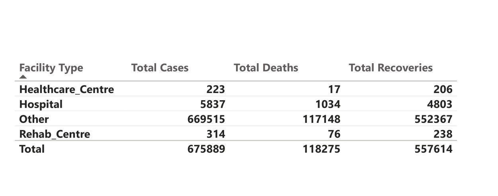

What this shows is that, in the context of this analysis, hospitals were not featured much, and this is to be expected because the data is based on records from mostly centres of care and not necessarily traditional hospitals.

_**WHAT IS THE DISTRIBUTION OF HEALTHCARE FACILITIES BY STATE**_

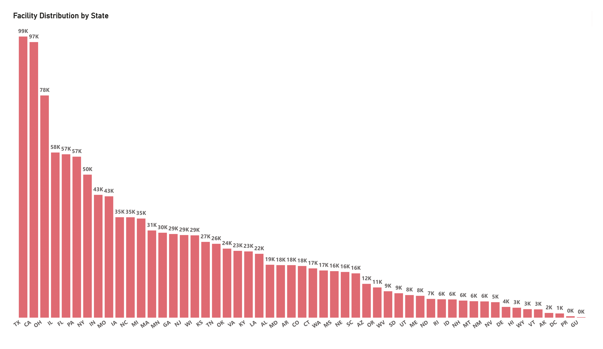

- Texas had the most healthcare facility, approcimately (99,000) healthcare facilities were availble for covid-19 related issues in the united states from 2020 to 2023
- California with about (97,000) facilities 

_**FIND THE HEALTHCARE FACILITY WITH THE HIGHEST OCCUPANCY RATE FOR COVID-19 PATIENTS**_

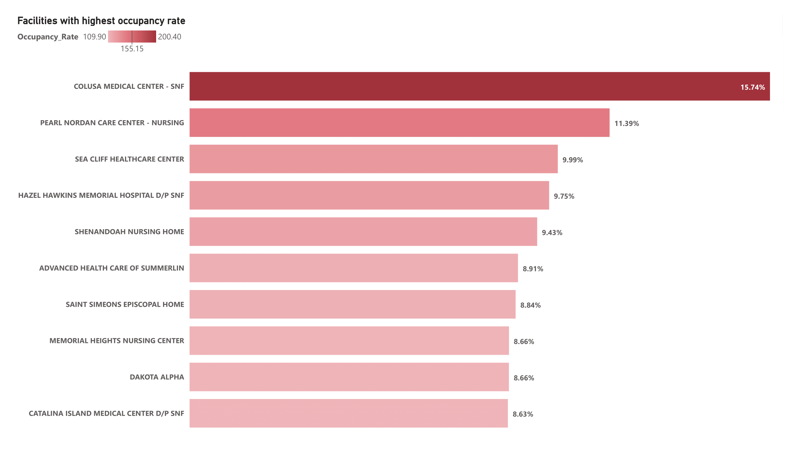

- Colusa Medical Centre had 15.74% occupancy rate 
- Pearl Nordan Care Centre sits second with 11.39%

## Dashboard

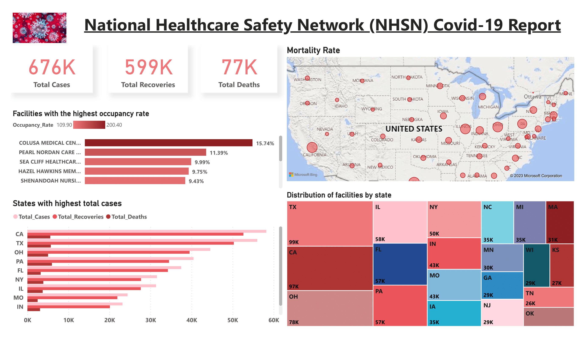

## Recommendations
- More focus should be placed on areas with relatively low cases but high mortality rates, with efective testing  and timely availablity of vaccines, the death rate can be contained.
- Ensure that more healthcare facilities and mobile units are made available in areas of low distribution.
- Lastly, improve vaccination campaigns to convince more people to get vaccinated and prevent spread.

## Data Limitation
- Absence of demographic information sucah as age of residents- If this information were availble, I beleive we would have derived more insights as to what age range was more prevalent in respect to case, deaths and reconeries.

## Conclusion
This best approach to curb the Covid-19 virus spread, is for everyone to adhere to strict protocols , based on the data, its gives great relief that the number of new cases have continued to drop from 2020 till 2023. As more data is made available, we'll continue to monitor trends and hopefully make more meaning of the situation and chart a sustainable way forward.

THANK YOU FOR STICKING WITH ME. Cheers

